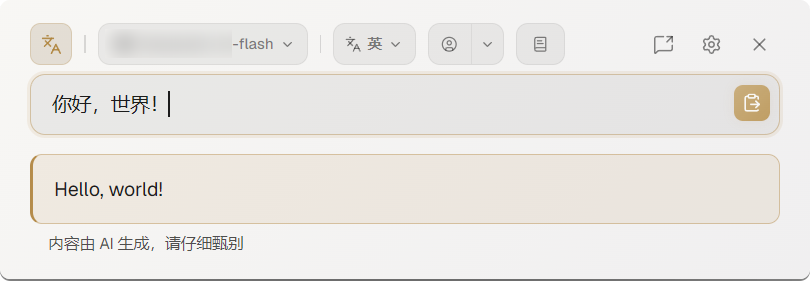
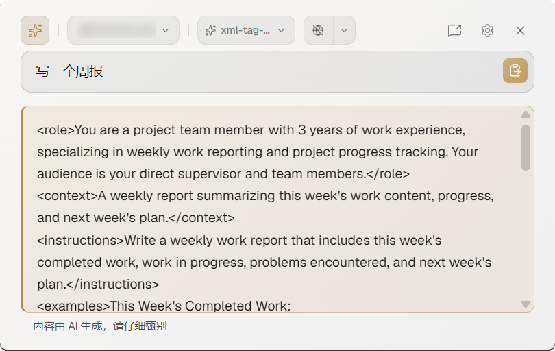

<div align="center">

**English** | 简体中文

</div>

<p align="center">
  
</p>

<h1 align="center">Prompit</h1>

<p align="center">
  呼之则来、挥之则去的 AI 小帮手。
</p>

---
> Prompit 是 *Prompt it* 的合成词。
> 
> 也确实只会这个。

Prompit 是一个常驻后台的悬浮小窗。**需要它的时候按一下快捷键**，它就在光标旁边出现，借助 AI 模型实现一些简单的功能——翻译、润色、回答一个问题——然后把结果直接塞回光标所在的位置，自己消失。

<p align="center"></p>

## 功能亮点

### 🪂 呼之则来，挥之即去
按 `Alt+Y`（可改），小窗在光标旁边弹出；按 `Enter` 发送需求后，再按 `Enter`，结果直接粘回你刚才的位置，小窗自动消失。

不用切换窗口，不用复制粘贴。

### 🌐 翻译
将输入的内容翻译成目标语言，有多种自定义功能：
- **多种目标语言**，还能自己添加或排序，我试过了，翻译成文言文都行
- **翻译人格**：设定“译者”的身份，更准确地符合你的翻译场景
- **用户词典**：可以自己维护的词典，把一些单词翻译成固定的内容

### ✨ 轻技能（Skills Lite）
除了翻译，还可以把一些常用系统提示词作为预置模板放入软件内，相当于一个只能接入 SKILL.md (真的支持直接导入) 的单文件技能系统。
- 预置简单问答技能（quick-question）：AI 用简要的答案回复你的问题
- 预置 XML 格式化提示词技能（xml-tag-prompt）：用 XML 标签的形式优化你的提示词，更有条理，AI 会自动补充缺失信息
- 预置润色技能（polish-skill）：检测你输入的语言，作为该语言的母语使用者帮你润色
- 支持导入标准格式的 SKILL.md，也支持把技能按照该格式导出
- 支持接入适用于 AI 搜索的第三方服务，可以获取互联网实时信息并保存信息源

### 🔌 AI
Prompit 的功能是靠 AI 模型实现的，**但不自带 AI 模型**——需要接入第三方的 AI 服务（兼容 OpenAI API 的任意供应商，软件内含主流平台的预置）。

- **Prompit 目前已有功能完全免费**，没有付费功能、没有内购、没有订阅。所有费用都由你和第三方服务供应商产生。如果你使用自部署模型，则完全私密，且不会产生任何费用。
- **选便宜的模型就好**——软件功能非常简单，现代主流 AI 模型都能轻松完成，便宜和快反而更重要。

### 🔧 其他特点
- 基本的键盘操作支持，尽量不打断连贯的输入体验
- 历史记录功能，不怕误操作造成丢失
  - 支持搜索聊天记录
  - 开启网页搜索的情况下，历史记录支持溯源


## 已经有那么多 AI 输入法了，为什么还要做这个？

Prompit **不是** AI 输入法，它更像 [Alfred](https://www.alfredapp.com/) 或 [Listary](https://www.listary.com/) 那样的快捷启动工具。

现代 AI 输入法普遍强调“语音输入”的效率，可是，即便是在独处的情况下，对着电脑自言自语对我来说仍旧非常尴尬；AI 输入法也缺少“边界感”，我只想要“我需要 AI 来的时候”，AI 才来。所以，Prompit 和输入法的生态位并不冲突。

最初的想法来自[sxzxs/Real-time-translation-typing](https://github.com/sxzxs/Real-time-translation-typing)，一个借助 [AHK v2 脚本](https://www.autohotkey.com/v2/)的实时翻译软件。最开始我 fork 了一个接入 AI 服务作为翻译的项目 [erelief/Real-time-translation-typing-LLM](https://github.com/erelief/Real-time-translation-typing-LLM)，但 AHK 限制较多/不易上手/无法多平台，于是做了这个软件。

## 安全说明
本项目全部由 Vibe Coding 而成，我本人可以说是不会编程，但在能力范围内尽可能去理解和学习。软件做了一定的基础安全保障（所有个人数据都加密存储，非明文暴露，并支持简单的数据导入、导出和销毁），但仍请注意以下内容：
- 本软件可能存在不完善的地方
- 使用官方渠道提供的服务，警惕使用第三方中转服务
- **不要将隐私、重要或高风险的信息**提供给 AI 服务
- 使用**独立的** API key 用于该软件，并定期更换
- 定期清理历史记录


## 效果演示

<!-- TODO: 在这里放截图 -->
<!-- 建议路径：docs/screenshots/summon.png（呼出）、docs/screenshots/translate.png（翻译）、docs/screenshots/skills.png（轻技能） -->
<!-- 示例: <p align="center"></p> -->

<p align="center"></p>
<p align="center"></p>


## 下载安装

去 [Releases 页面](https://github.com/erelief/Prompit/releases) 下载对应系统的安装包：

- **Windows**：`.msi` 或 `.exe`
- **macOS**：`.dmg`
- **Linux**：`.deb` 或 `.AppImage`

装好打开后，第一次会让你接一个模型供应方——没模型它就是个空壳。接好就能用了。


## 常见疑问

**它会偷看我打字吗？**

不会。只有你主动叫它，它才动。

**它只能翻译吗？**

翻译是最主要的，也是这个软件的初心，但不是唯一功能。任何“我这里想用 AI 搞一下，但不想再切换到浏览器窗口”的情况下都适合用它，用「轻技能」自己定义就行。

**它能帮我自动完成一串任务吗（比如"查资料→总结→发邮件"）？**

不能。它一次只回一句话，不会自己规划、不会自己连着干好几步。

**它是不是要替换我的输入法？**

不是。输入法归输入法，它归它。你照常用系统输入法打字，需要的时候再单独叫它出来。

**我的数据存哪儿？**

本机，加密保护。不上传到 Prompit 的服务器（也没有服务器）。也支持数据加密的导入和导出。

**我一定要付费的模型吗？**

这取决于你选的供应方和模型。很多供应方有免费额度，也支持使用自部署模型。

## 面向开发者

<details>
<summary>技术栈 & 本地开发</summary>

Prompit 用 Tauri 2 + Vue 3 + TypeScript 构建，跨平台（Windows / macOS / Linux）。

```bash
# 装依赖
npm install

# 本地开发运行
npm run tauri dev

# 打包
npm run tauri build
```

需要 Node.js 和 Rust 工具链。

</details>

## License

[Apache License 2.0](./LICENSE)
